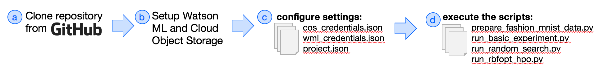

### Four steps to faster batch training
These python utilities simplify the process of executing batch experiments in Watson Studio.  If you want more detailed setup instructions, then see the next section below setup.  Otherwise it's a simple 4-step process. (1) cloning the repository then (2) [install the Watson Machine Learning (WML) python client](https://wml-api-pyclient-dev.mybluemix.net/).  (3) if you're already familiar with WML and Cloud Object Storage, then you simply copy your credentials to [wml_credentials.json](settings/wml_credentials.json) and [cos_credentials.json](settings/cos_credentials.json), and (4) [execute the examples scripts showcasing sample batch experiments]().

  

